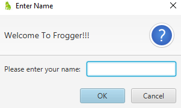
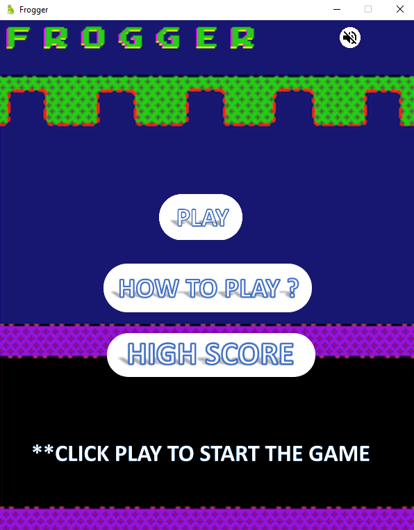
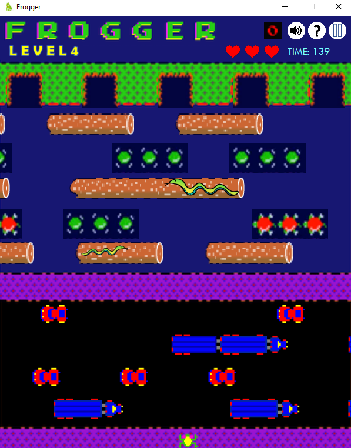

# COMP2042_CW_LeeHuiFang
This project is about maintaining and extending on a classic retro game(Frogger).

## Maintenance

1. Remove/Edit bugs
	<ol type="i">
		<li>Edit the image link which is not existed.</li>
		<li>Edit the point calculation system.</li>
	</ol>

2. Create new method without affecting the main function so the code looks neater and less complicated.
		
3. Set false to preserveratio image(s) so the image displayed nicer and clearer.
	
4. Edit intersection method by adding speed variable to get the speed of obstacle intersected. Speed contains the moving direction of obstacle(s).
   Therefore, getLeft() method is removed.
	
5. Changes in variable
	<ol type="i">
		<li>Change access modifier to private to hides the data. Create setter & getter method if needed.</li>
		<li>Group the variables to datatype, so code looks neater.</li>
		<li>Change the datatype of size to double to increase accuracy and the superclass returns the size in double.</li>
		<li>The variable imgsize is splitted into width and height as not all images are square shaped.</li>
		<li>Rename the variable, so the code can be easily understood.</li>
		<li>Create new ArrayList variables to save the actor created, so can be access easily.</li>
	</ol>
	
6. Changes in constructor
	<ol type="i">
		<li>Set position of image as parameter, so code maintenance is easier.</li>
		<li>Rename parameters, so the code is more understandable.</li>
		<li>Change the datatype of parameters to double to increase accuracy.</li>
		<li>Edit the sequence of parameter, so constructor with similar usage looks uniform.</li>
	</ol>
	
8. Remove unused code such as commented codes, parameter from constructor, unused variable and condition never met. Therefore, the code more understandable and prevent confusion.
	
9. Edit spacing and indentation(s), so it looks neater and easier to read.
	
10. Add comments & create javadocs so the code easier to understand by others.

11. Split the files into packages and remove unwanted package(s).

12. Create class for each level. Therefore, code maintenance is easier as each level is unique.

13. Use lambda expression to handle event(s), so the line of coding is shorter and the code easier to read.

14. Apply Factory Design Pattern so the creation logic of object(s) is hidden to the client.

15. Apply MVC Pattern which divides the program into Model, View and Controller. Therefore, the code for front-end and back-end is separated.

16. Use JavaFX Scene Builder to deal with the interface.

17. Create Junit tests to ensure that the classes/methods run without errors.

18. Create Maven file to build the project easily by adding the dependencies.
	<ul>
		<li>Maven Goals -> compile install javafx:run.</li>
	</ul>

## Extension

1. Create a main menu screen to improve user-friendliness.

2. Get the player name and set the limitations.
	
3. Create life function, life is deducted if frog hits an obstacle/drowns.

4. Create buttons to display instruction, pause/resume game, mute/play background music.
	
5. Display the score of previous level at the end of each level and ask whether to proceed to next level.

6. Save the score and player name in a text file. 

7. Create timer to count the time player used to complete/lose the game.

8. Display alert box if user accidentally close the application.

## Screenshot of Game
  
  
